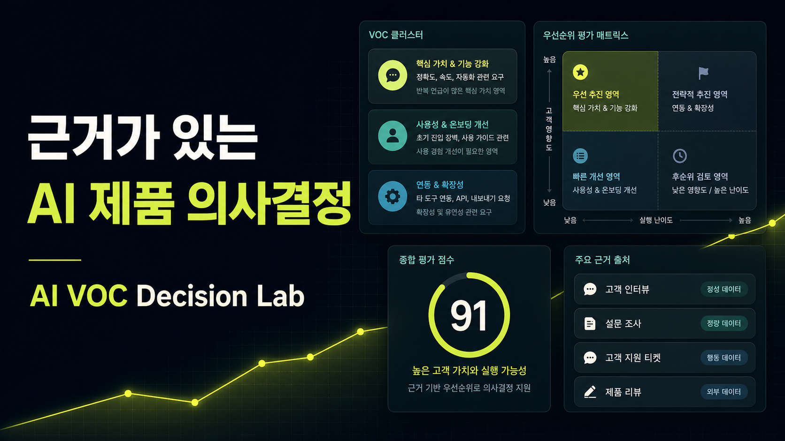
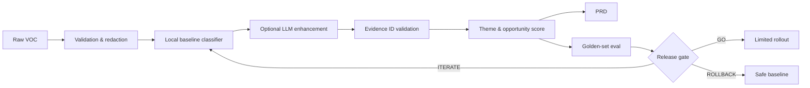

# AI VOC Decision Lab

고객 피드백 24건을 **근거가 연결된 문제 신호 → 우선순위 → PRD → 품질 평가 → 출시 판단**으로 바꾸는 AI 제품 기획 포트폴리오입니다.

**[라이브 데모 실행하기](https://ai-voc-decision-lab-gdy.hakukaka1212.chatgpt.site)**



## 왜 만들었나

AI 제품은 그럴듯한 출력을 만드는 것만으로 출시할 수 없습니다. 제품 기획자는 사용자 문제를 좁히고, 개발자는 결과를 재현 가능하게 만들며, 둘 다 품질·비용·위험의 기준을 설명할 수 있어야 합니다. 이 프로젝트는 그 전체 판단 과정을 한 화면과 코드로 보여줍니다.

## 핵심 기능

- 한국어 VOC의 문제 주제 분류와 기회 점수 계산
- 인사이트마다 실제 원문 ID를 연결하는 evidence-first UX
- 최상위 문제에서 사용자 스토리·수용 기준·성공 지표를 포함한 PRD 생성
- 골든셋 기반 주제 정확도, 인용 유효성, 안전성 회귀 평가
- 개인 OpenAI API 키를 세션에서만 연결하는 실제 Responses API 분석
- 직접 붙여넣은 VOC를 3~6개 동적 문제 주제로 군집화하고 원문 ID 검증
- AI 실패 시에도 동작하는 로컬 규칙 엔진과 안전한 자동 폴백
- GO / ITERATE / ROLLBACK 판단을 위한 명시적 품질 게이트

## 실행

```bash
npm install
npm run dev
```

테스트는 분석 엔진 단위 테스트, 프로덕션 빌드, 서버 렌더링 검증을 순서대로 실행합니다.

```bash
npm test
```

별도 API 키 없이 데모가 동작합니다. 화면에서 개인 OpenAI API 키를 입력하면 키를 저장하지 않고 해당 분석 요청에만 사용합니다. 서버 운영 키를 쓰려면 `.env.example`의 값을 설정할 수 있습니다. 오류·타임아웃·잘못된 인용이 발생하면 안전하게 로컬 결과로 되돌아갑니다.

## 설계



## 현재 평가 결과

| 지표 | 결과 | 기준 |
|---|---:|---:|
| 종합 릴리스 신뢰도 | 91 | 85 이상 |
| 주제 정확도 | 88% | 85% 이상 |
| 인용 유효성 | 100% | 100% |
| 안전 시나리오 통과율 | 95% | 95% 이상 |

모호한 VOC 1건은 안정성과 신뢰 사이에서 오분류됩니다. 이를 숨기지 않고 `REVIEW`로 노출했으며, 다음 버전에서 모호성 라벨과 사람 검토 큐를 추가할 계획입니다.

## 문서

- [제품 요구사항](./docs/PRD.md)
- [평가 설계](./docs/EVALUATION.md)
- [포트폴리오 역량 분석](./docs/PORTFOLIO_STRATEGY.md)

## 한계와 다음 단계

- 샘플 데이터는 실제 고객 개인정보를 포함하지 않는 합성 데이터입니다.
- 현재 로컬 엔진은 키워드 기반 베이스라인입니다. 실제 운영에서는 임베딩 군집과 LLM structured output을 비교합니다.
- 온라인 A/B 테스트, 사용자별 권한, 장기 저장은 MVP 범위에서 제외했습니다.
- 다음 단계는 CSV 파일 업로드, 검토 큐, 프롬프트 버전별 비용·지연시간 관측입니다.
